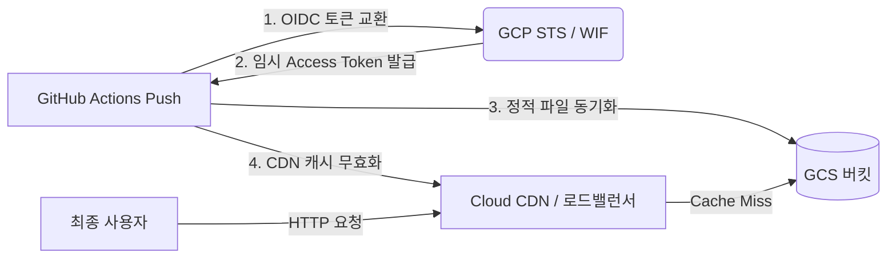

# GitHub Actions 및 Workload Identity Federation 기반 GCS & Cloud CDN 자동 배포

본 프로젝트는 서비스 계정 키(Service Account Key JSON) 없이 **Workload Identity Federation (WIF)**을 사용하여 GitHub Actions에서 Google Cloud Storage (GCS)로 정적 웹사이트를 안전하게 배포하고, Global HTTP Load Balancer 및 Cloud CDN 캐시를 자동으로 무효화하는 인프라 및 CI/CD 파이프라인을 구축합니다.

---

## 🏗 아키텍처 개요



### 주요 구성 요소:
- **Workload Identity Federation (WIF)**: 영구적인 서비스 계정 키 생성 없이 GitHub OIDC 토큰으로 GCP 인증 수행 (Keyless 인증).
- **서비스 계정 (`github-deployer`)**: 최소 권한 원칙에 따라 GCS 쓰기 권한(`roles/storage.objectAdmin`) 및 CDN 무효화 권한(`roles/compute.loadBalancerAdmin`)만 부여.
- **GCS 버킷**: 정적 웹 파일(`index.html`, `404.html`) 호스팅.
- **글로벌 외부 HTTP 로드밸런서 & Cloud CDN**: 전 세계 Edge 캐싱 제공, 빠른 웹사이트 전달 및 단일 외부 IP 제공.

---

## 📁 디렉터리 구조

```text
github-to-gcs-cdn-deployer/
├── main.tf           # Terraform 리소스 (WIF, 서비스 계정, GCS, CDN & 로드밸런서)
├── variables.tf      # 변수 정의
├── terraform.tfvars  # 배포 대상 GCP 프로젝트 및 GitHub 저장소 설정
├── outputs.tf        # 출력값 (로드밸런서 IP, WIF Provider ID, SA 이메일)
├── public/           # 정적 웹사이트 소스 파일 디렉터리
│   ├── index.html
│   └── 404.html
├── .github/
│   └── workflows/
│       └── deploy-cdn.yml  # GitHub Actions 배포 워크플로우
└── README.md         # 프로젝트 안내 문서
```

---

## 🚀 배포 가이드

### 1단계: Terraform을 통한 GCP 인프라 구축

1. `terraform.tfvars` 설정 파일을 본인의 환경에 맞게 수정합니다:
   ```hcl
   project_id  = "YOUR_GCP_PROJECT_ID"
   github_repo = "ge-demo-org/github-to-gcs-cdn-deployer"
   bucket_name = "YOUR_UNIQUE_BUCKET_NAME"
   region      = "asia-northeast3"
   ```

2. Terraform 초기화 및 배포를 실행합니다:
   ```bash
   terraform init
   terraform apply
   ```

3. 출력된 결과값(Outputs)을 확인합니다:
   - `workload_identity_provider_name`
   - `service_account_email`
   - `load_balancer_ip`

---

### 2단계: GitHub Actions 워크플로우 구성

`.github/workflows/deploy-cdn.yml` 파일에서 `workload_identity_provider`, `service_account`, `destination` 값을 `terraform apply` 출력값에 맞춰 업데이트합니다.

---

## 🔒 보안 특장점 (Security Best Practices)

1. **키 없는 인증 (Keyless Authentication)**: GCP 서비스 계정 JSON 비대칭키를 발급하지 않으므로 키 유출 및 관리 위험 차단.
2. **엄격한 속성 조건 (`attribute_condition`)**: OIDC Provider 생성 시 `assertion.repository == "ge-demo-org/github-to-gcs-cdn-deployer"` 조건을 필수 부여하여 지정된 GitHub 리포지토리의 토큰만 인증 허용 (스푸핑 방지).
3. **최소 권한 부여 (Least Privilege)**: 배포용 서비스 계정에 버킷 관리 및 CDN 무효화에 필요한 역할만 한정적으로 부여.